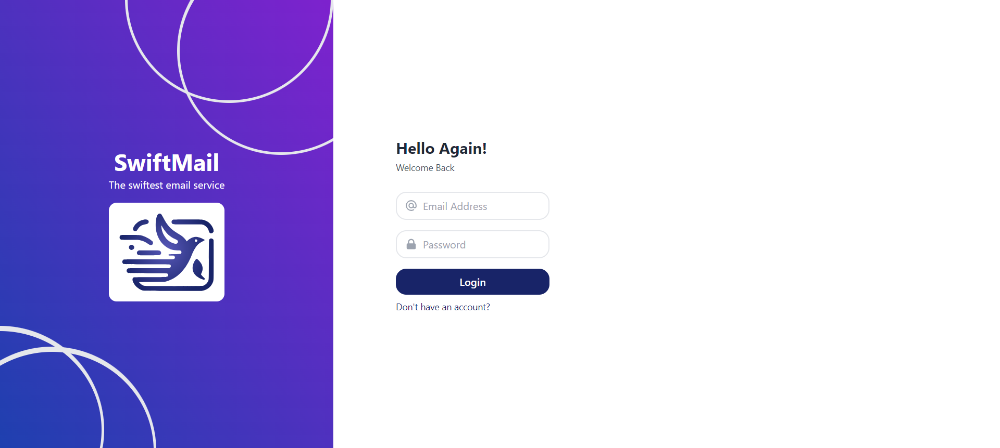

# Final Design Plan

This is the Design Plan for our Swift Email. We will provide a description of how we abstracted the project and solved it based on our technical skills and teamwork. For this project, we utilized HTTP's methods. To get or receive a message, we used the `GET` method, and to send a message, we used `POST`. Additionally, for the login process, we employed a `POST` method to save the new user information in the database and then a `GET` method to retrieve all information about this user, such as received emails.

## Technologies and Frameworks

### Backend

For the backend, we used Python with Django, and for the databases, PostgreSQL. The following APIs were created for the email service:

- Get in the admin console of the PostgreSQL database. (`admin/`)

- Register the user. (`api/register/ [name='register']`)

- Login user to the email service. (`api/login/ [name='login']`)

- Logout the user when they want to stop using the service. (`api/logout/ [name='logout']`)

- Send an email from one user to another. (`api/send-email/ [name='send_email']`)

- Get the emails sent to the current user. (`api/receive-email/<str:email>/ [name='received_email']`)

## Frontend

### Technologies and Frameworks

- TypeScript
- Jest
- Axios
- React

In the frontend, we utilized TypeScript with React. The design was crafted based on the following color palette (specified with color codes).

### Color Palette

- Primary Color: `#5858B9`
- Secondary Color: `#A459E1`
- Accent Color: `#182468`

### User Interface Design

The features implemented can be described as follows:

#### Login 

The user can login with their email address and password. That information will be verified so the user can use the service. If the user is not registered can do it clicking in the bottom “Don’t you have an account?”

#### Register

If the user does not have an existing account, they can create a new account providing data like Full Name, Email Adress and Password.

#### Receive emails

The main page of the service has two bottoms Inbox and Compose, the inbox bottom shows all the received emails so the user can see them.

#### Compose email

When a user wants to send an email, they can click on the Compose bottom and a form is shown. Then they fill the boxes Subject, Email and Body.

## CI/CD, QA

For CI/CD pipelines we decided to use Github Actions because of its facility to create a workflow and it is easy to deploy on AWS. Every time a push is made to the main branch of the repository two images of docker are created and uploaded to Docker Hub so the EC2 instances can run these images in its own containers.

With GitHub Actions every time a push is made to the main branch. A series of tests run that evaluate the performance of backend and frontend, meaning the Django biuld, Node build and the production branch.

### Deployment

For the development of Swift Email two AWS services were used.

#### RDS
The Postgres databased is saved in an RDS. First was created locally and then all the information was migrated to the AWS service.

#### EC2
Two instances of this service were used for this project due the big necessity of resources power that were needed.

  - An EC2 was used for the backend. It is running in the public IP 18.228.223.130 in the port 8000. The configuration for this EC2 is composed by a t2.micro, a storage of 8GiB and Ubuntu as the OS. Here its running a docker container with the image of the backend downloaded from the Docker Hub repository. It has Inbound rules that uses the TCP protocol to enable ports and the correct work of these instance, in this case the ports allowed are 8000, 443, 80, 22, 3000. All with 0.0.0.0/0 as the source, because we are interested that anybody can use it.

  - An EC2 was used for the frontend. It is running in the public IP 54.207.91.204 in the port 3000. The configuration for this EC2 is composed by a t2.micro and a storage of 8GiB Ubuntu as the OS. Here its running a docker container with the image of the frontend downloaded from the Docker Hub repository. It has Inbound rules that uses the TCP protocol to enable ports and the correct work of these instance, in this case the ports allowed are 443, 80, 22, 3000. All with 0.0.0.0/0 as the source, because we are interested that anybody can use it.

## Security

With Github Actions we are going to use secrets, in this case for database access, AWS credentials and Docker Hub credentials.

Also, the backend uses cookies so the user can be sure their information is not going to be shared with anyone.

In fact, as this project is basic, we just put our efforts in the integration between the backend and frontend its CI/CD and deployment on AWS. So, we choose those options to learn as much as we can and to have an “email” functional and usable.
